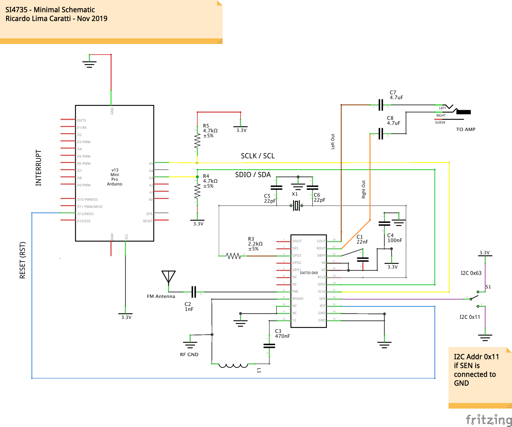

# Examples

This folder has some examples that might help you to use the Si4735 Arduino Library in your project. If you find some error or problem during your implementation, please let me know. 

## Summary

1. [Example 01 - Proof of Concept](https://github.com/pu2clr/SI4735/tree/master/examples#example-01---proof-of-concept)
2. [Example 02 - Proof of Concept with SW](https://github.com/pu2clr/SI4735/tree/master/examples#example-02---proof-of-concept-with-sw)
3. [Schematic for Proof of Concept (Examples 01 and 02)](https://github.com/pu2clr/SI4735/tree/master/examples#schematic-for-proof-of-concept-examples-01-and-02)
4. [Example 03 - SS4735 Arduino Library example with LCD 20x4 I2C](https://github.com/pu2clr/SI4735/tree/master/examples#example-03---ss4735-arduino-library-example-with-lcd-20x4-i2c)
5. [Example 04 - SS4735 Arduino Library example with I2C OLED](https://github.com/pu2clr/SI4735/tree/master/examples#example-04---ss4735-arduino-library-example-with-i2c-oled)
6. [Schematic for I2C display device, buttons and encoder (Examples 03 and 04)](https://github.com/pu2clr/SI4735/tree/master/examples#schematic-for-i2c-display-device-buttons-and-encoder-examples-03-and-04)
7. [Example 05 - Bandwidth filter on MW (AM)](https://github.com/pu2clr/SI4735/tree/master/examples#example-05---bandwidth-filter-on-mw-am)
8. [Example 06 - Bandwidth filter test (9 band SW Receiver with OLED)](https://github.com/pu2clr/SI4735/tree/master/examples#example-06---bandwidth-filter-test-9-band-sw-receiver-with-oled)

 
 

## Example 01 - Proof of Concept

The main advantage of using this Proof of Concept is: you do not need to connect any display device to make your radio works. The Arduino IDE is all you need to control the radio.  So, I strongly recommend starting with this sketch. This example is a proof of concept of SI4735 Arduino Library. The [SI4735_POC.ino](https://github.com/pu2clr/SI4735/tree/master/examples/SI4735_POC) sketch uses just the __Serial Monitor__ and works only on your __Arduino IDE__. However, you can easily replace the Serial Monitor functions to the device functions that you want to use. 

Click [here](https://github.com/pu2clr/SI4735/blob/master/examples/SI4735_01_POC/SI4735_01_POC.ino) to see this example.

 
 

## Example 02 - Proof of Concept with SW

This example shows how can you use SW features of the Si4735 Arduino Library. Like the previous exemple (Proof of Concept), the [SI4735_POC_SW.ino](examples/SI4735_POC_SW/SI4735_POC_SW.ino) sketch __works only on Arduino IDE__. It uses the Serial Monitor to get the commands and show the information. 

Click [here](https://github.com/pu2clr/SI4735/blob/master/examples/SI4735_02_POC_SW/SI4735_02_POC_SW.ino) to see this example.

 

## Schematic for Proof of Concept (Examples 01 and 02)

The schematic below is the same shown at the main page of this project and shows how you can setup you SI4735 device.

 
 

## Example 03 - SS4735 Arduino Library example with LCD 20x4 I2C

This sketch uses the Rotary Encoder Class implementation from Ben Buxton. The source code is included together with this sketch. This sketch also uses the LiquidCrystal I2C Library by Frank de Brabander. You can install LiquidCrystal I2C via Manage Libraries on your Arduino IDE. 

Click [here](https://github.com/pu2clr/SI4735/blob/master/examples/SI4735_03_LCD_20x4_I2C/SI4735_03_LCD_20x4_I2C.ino) to see this example.

__Click [here](https://youtu.be/vzunuxam_Lg) to see a video about this example__.

 
 

## Example 04 - SS4735 Arduino Library example with I2C OLED

This sketch uses the Rotary Encoder Class implementation from Ben Buxton. The source code is included together with this sketch. This sketch also uses the SSD1306Ascii Arduino Library by Bill Greiman. You can install SSD1306Ascii via Manage Libraries on your Arduino IDE. The photo below show this example on a protoboard. 

Click [here](https://github.com/pu2clr/SI4735/blob/master/examples/SI4735_04_OLED_I2C/SI4735_04_OLED_I2C.ino) to see this example.

__Click [here](https://youtu.be/7Sg4z8tDSA8) to see a video about this example__.

 
 

## Schematic for I2C display device, buttons and encoder (Examples 03 and 04)

The schematic below is a sugestion to connect a I2C Display (OLED or LCD 20x4 or another device), buntons and encoder as well. 

__Pay attention to the your I2C device voltage. The system can become unstable if you are using a wrong voltage__.

 
 

## Example 05 - Bandwidth filter on MW (AM)

Bandwidth of the channel filter for AM reception.  This sketch tests the bandwidth configuration on Si4735 device. It uses the Serial Monitor (Arduino IDE). The choices are: 6, 4, 3, 2, 2.5, 1.8, or 1 (kHz).
 
Click [here](https://github.com/pu2clr/SI4735/blob/master/examples/SI4735_05_AM_FILTERS/SI4735_05_AM_FILTERS.ino) to see this example.

 
 

## Example 06 - Bandwidth filter test (9 band SW Receiver with OLED)

This example is a 9 band SW receiver based on SI4735.  It shows the selection of the bandwidth of the channel filter for AM reception (in this case SW). The choices are: 6, 4, 3, 2, 2.5, 1.8, or 1 (kHz). With this resource, you can separate  two stations in adjacent channels. __You can use the same schematic shown for the examples 03 and 04__. 

Click [here](https://github.com/pu2clr/SI4735/blob/master/examples/SI4735_06_SW_OLED_FILTER_TEST/SI4735_06_SW_OLED_FILTER_TEST.ino) to see this example.

__Click [here](https://youtu.be/dN1s3RoXGos) to see a video about this example__.

